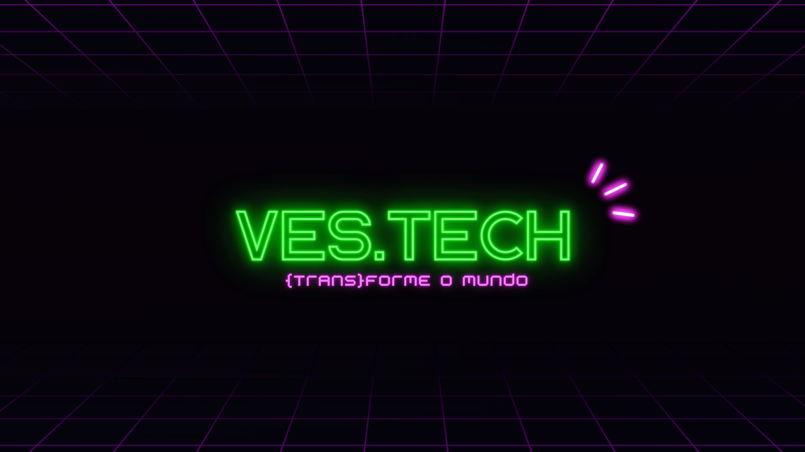
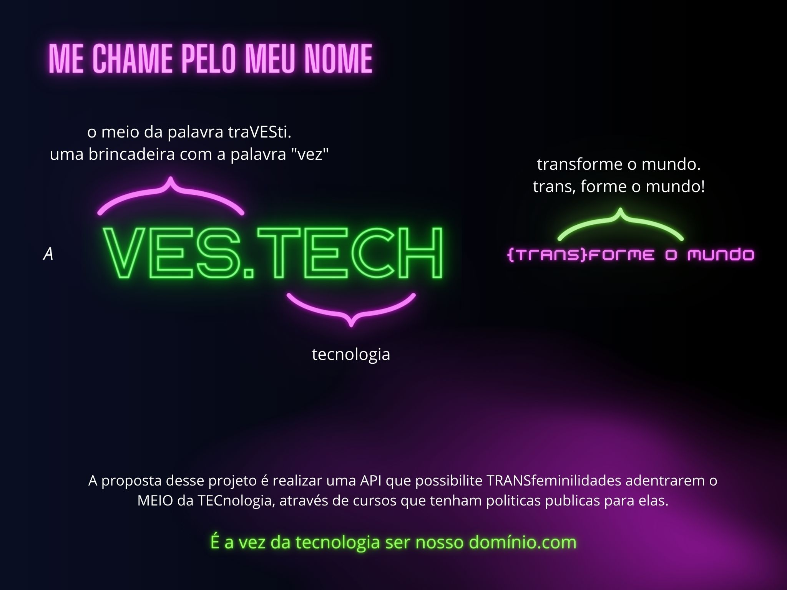
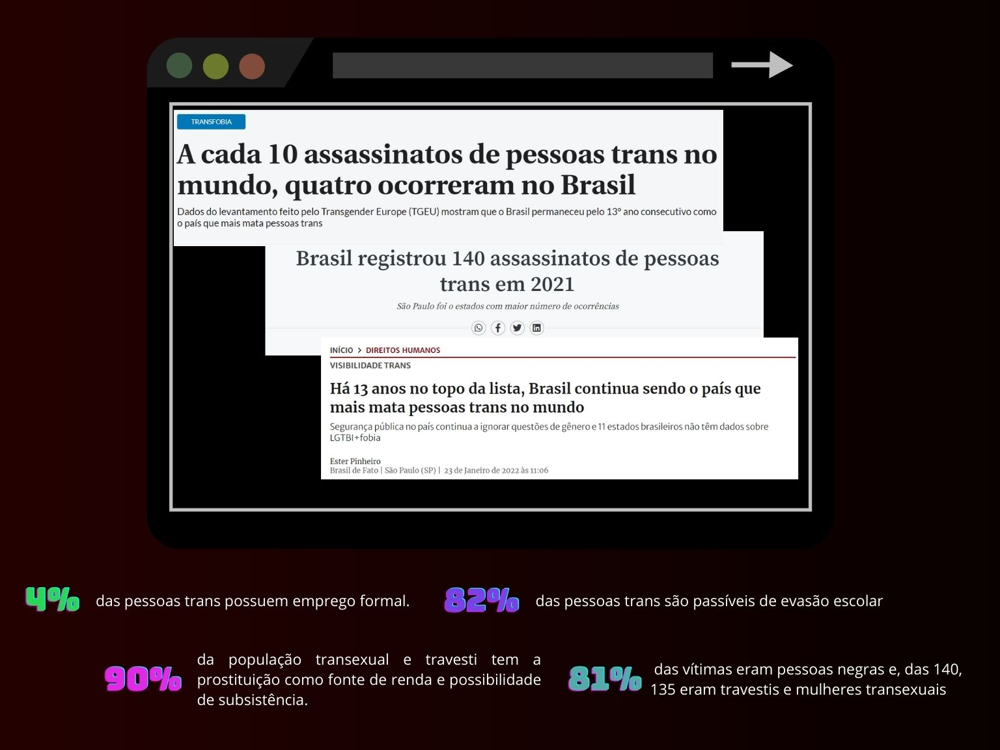
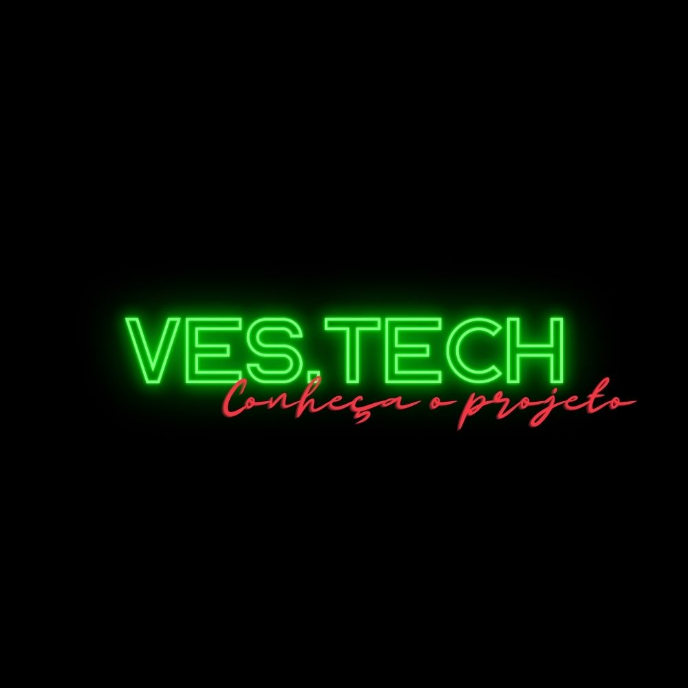
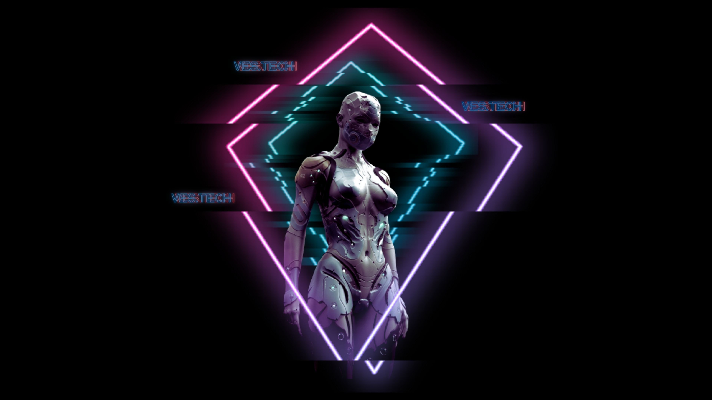

[](https://reprograma-ves-tech.herokuapp.com/)
 
 

<a></a>

<p align="center">

<p align="center"> <p></h1>

> A **VES.TECH** tem a proposta de disponibilizar o acesso a cursos de capacitação na area da tecnologia que tenham ações afirmativas voltadas para mulheres trans e travestis   


## 🌈 **Apresentação** 

A **VES.TECH - {trans}forme o mundo** é o projeto de conclusão do bootcamp de back-end da Turma On16 da [{Reprograma}](https://www.reprograma.com.br/).

 Este projeto é uma API com CRUD completo que contém um banco de dados, Autenticação e Login. Possui a intenção de cadastrar instituições que possuam cursos com politicas afirmativas voltadas a mulheres trans e travestis.


## 📊 **Justificativa**

Atualmente grande parte da população de mulheres trans e travestis, principalmente negras, se encontram trabalhando como profissionais do sexo. As que estão alocadas nesse meio por opção são poucas, a maioria foi empurrada para esse espaço. Não obstante, o Brasil continua em primeiro lugar como o país que mais mata pessoas trans no mundo, assim como o que mais tem evasão escolar e busca em sites pornograficos com esses mesmos corpos. Os únicos outros espaços que abarcam e “acolhem” mulheres trans e travestis são subempregos como os de cabeleireira, manicure e/ou telemarketing.
 
Pensando nisso, esse projeto tem o objetivo de reunir, apresentar e capacitar mulheres trans e travestis através de cursos que sejam voltados a esse público ou que sejam gratuitos. Principalmente, cursos da área da tecnologia como: back-end, front-end, análise de dados, entre outros. Por que? Bom, em uma realidade onde corpos trans são empurrados para a marginalidade pela estrutura colonial, patriarcal, elitista e higienista, proporcionar outras maneiras de se viver, não apenas sobreviver, é proporcionar garantia de direitos, cidadania e principalmente: opções. 

## 📈**Fonte dos dados**
- [Correio Braziliense](https://www.correiobraziliense.com.br/brasil/2021/11/4963887-no-mundo-a-cada-10-assassinatos-de-pessoas-trans-quatro-foram-no-brasil.html)
- [Agência Brasil](https://agenciabrasil.ebc.com.br/direitos-humanos/noticia/2022-01/brasil-registrou-140-assassinatos-de-pessoas-trans-em-2021)
- [Brasil de Fato](https://www.brasildefato.com.br/2022/01/23/ha-13-anos-no-topo-da-lista-brasil-continua-sendo-o-pais-que-mais-mata-pessoas-trans-no-mundo)
- [Antra](https://antrabrasil.org/)


## 🎮 **Funcionalidades**

#### **Para os cursos**

✔️ Cadastro de novos cursos

✔️ Listar todos os cursos

✔️ Visualizar cursos por titulo

✔️ Visualizar cursos por disponibilidade

✔️ Atualizar um curso específico pelo ID

✔️ Remover um curso específico do banco de dados

✔️ Visualizar cursos por categoria (Ex:JavaScript, HTML, CSS)

✔️ Visualizar cursos por politica afirmativa (Ex: mulheres trans, travestis)  

## 🏗️ **Arquitetura MVC**

```
  📁 reprograma-VES.TECH    
  |-  📁 images         
  |-  📁 node_modules
  |-  📁 Swagger    
  |         |- 📄 swagger_output.json   
  |-  📁 src  
  |    |- 📁 database  
  |         |- 📄 mongooseConnect.js    
  |    |- 📁 controllers    
  |         |- 📄 coursesController.js    
  |         |- 📄 institutionsController.js    
  |         |- 📄 usersController.js 
  |    |- 📁 models  
  |         |- 📄 coursesModel.js    
  |         |- 📄 institutionsModel.js    
  |         |- 📄 usersModel.js 
  |    |- 📁 routes  
  |         |- 📄 coursesRoutes.js     
  |         |- 📄 institutionsRoutes.js   
  |         |- 📄 usersRoutes.js    
  |         |- 📄 usersRoutes.js 
  |    |- 📄 app.js  
  |-  📁 test 
  |         |- 📄 courses.test.js 
  |         |- 📄 institutions.test.js  
  |-  📄 .env
  |-  📄 .env.example 
  |-  📄 .eslintrc  
  |-  📄 .gitignore 
  |-  📄 LICENSE  
  |-  📄 package-lock.json   
  |-  📄 pakage.json 
  |-  📄 Procfile
  |-  📄 README.md 
  |-  📄 sendgrid.js
  |-  📄 server.js
  |-  📄 Swagger.js    
  ```


## 📦 **Dependencias e Tecnologias**

**Base do projeto**
```
Controle de versões: 
Git/GitHub

Editor de código - IDE:
VSCode

Desenvolver o back-end em Javascript:
Nodejs
```
 
**Instalações iniciais**

```
Package.json em JS:
npm init -y

Express, cors e node_modules:
npm i express cors

Nodemon:
npm i -D nodemon
```

**Banco de dados**
```
Mongoose:
npm i mongoose
```

**Autententicação**

```
Jwt:
npm install jsonwebtoken -- save

Bcrypt:
npm install bcrypt -- save
```
**Variaveis de ambiente**
```
Dotenv:
npm install dotenv-safe -- save
```

**Testes**

```
ESlint:
npm install --save-dev eslint@8.16.0
npx eslint --init

Jest:
npm install --save-exact jest@28.1.0
```

**Documentação**

```
Swagger:
npm i swagger-autogen swagger-ui-express
```

**Serviço de e-mail**
```
Sendgrid:
npm @sendgrid/mail
```

## 🔒 **Variáveis de Ambiente**

*Para rodar esse projeto, você vai precisar adicionar as seguintes variáveis de ambiente no seu .env*

`PORT=NUMERO_PORTA`  
`SECRET=CHAVE_HASH_SEM_ESPAÇO`  
`DATABASE_URI=CONEXÃO_COM_MONGO_SEM_ASPAS`  
`SENDGRID_API_KEY=CHAVE_API_KEY_SEM_ESPAÇO`  

<br>

## 📌 **Rotas - EndPoint**

<br>

 📢 Todas as rotas existentes neste projeto:

- Usuários

| Verbo  |   EndPoint      |        Descrição da Rota                   | Status | Auth |
| ------ | --------------- | -------------------------------------------| ------ |----- |
| POST   | /user           | Adicionar um novo usuário                  |   201  |  ❌  |
| GET    | /users/         | Listar todos os usuários                   |   200  |  ❌  |
| GET    | /users/:id      | Mostrar usuário pelo ID                    |   200  |  ❌  |
| DELETE | /user/config/:id| Remove um usuário                          |   200  |  ✔️  |
| POST   | /user/login/:id | Devolve o token de um usuário              |   200  |  ✔️  |
<br>

- Instituições

| Verbo  |   EndPoint             |         Descrição da Rota                         | Status | Auth |
| ------ | ---------------------- | --------------------------------------------------| ------ |----- |
| GET    | /institution           | Listar todas as instituições cadastradas          |   200  |  ❌  |
| GET    | /institutions/:id      | Mostra instituição por ID                         |   200  |  ❌  |
| POST   | /institutions          | Registra uma nova instituição                     |   201  |  ✔️  |
| PATCH  | /institution/update/:id| Altera alguma informação de uma instituição       |   201  |  ✔️  |
| DELETE | /settings/:id          | Remove uma instituição cadastrada                 |   200  |  ✔️  |
<br>

- Cursos  

| Verbo  |   EndPoint          | Descrição da Rota                           | Status | Auth |
| ------ | ------------------- | ------------------------------------------- | ------ |----- |
| GET    | /courses            | Listar todos os cursos cadastrados          |   200  |  ❌  |
| GET    | /users/courses/:id  | Mostra curso cadastrado por ID              |   200  |  ❌  |
| GET    | /courses/coursetitle| Mostra curso cadastrado por título          |   200  |  ❌  |
| GET    | /courses/affirmativepolicies| Mostra curso cadastrado por politicas afirmativas    |   200  |  ❌  |
| GET    | /courses/available  | Mostra curso cadastrado por disponibilidade |   200  |  ❌  |
| GET    | /courses/category   | Mostra curso cadastrado por categoria       |   200  |  ❌  |
| GET    | /courses/categoryandaffirmativepolicies | Mostra curso cadastrado por categoria e por politicas afirmativas |   200  |  ❌  |
| POST   | /institution/course | Registra um novo curso                      |   201  |  ✔️  |
| PATCH  | /institution/courses/:id | Altera alguma informação sobre o curso |   201  |  ✔️  |
| DELETE | /institution/course/:id  | Remove o cadastro de um curso pelo ID  |   200  |  ✔️  |

<br>

 *PROTEÇÃO* Para testar via Postman, passar bearer token no header de autenticação $ Bearer Token


<br>

## 📚 **Documentação da API**

📝 [Swagger](https://reprograma-ves-tech.herokuapp.com/my-documentation/)

📝 [Heroku](https://reprograma-ves-tech.herokuapp.com/)

<br>

## ✨ **Instalação e Contribuição no projeto** 

1. Faça um **fork** do projeto.
2. Realize o clone do projeto através do `git clone <link_do_fork_do_repositorio>`
3. Crie uma nova branch com as suas alterações: `git checkout -b minha-branch`
4. Instale as dependências necessárias à execução da API através do comando `npm install`
5. Salve as alterações e crie uma mensagem de commit contando o que você fez: `git commit -m "feature: Minha contribuição"`
6. Envie as suas alterações: `git push origin minha-branch`

<br>

## 🗺️ **Referências**

- [Informações para licenças](http://escolhaumalicenca.com.br/licencas/mit/#) 
- [Emojis](https://emojipedia.org/)
  


## 💞**Agradecimentos**

Agradeço inicialmente a todas as travestis e mulheres trans que vieram antes de mim, pois essa conquista não seria possivel sem vocês, de Manicongo as minhas irmãs do presente: OBRIGADA!;   
A minha mãe e a minha amiga Fariza por me apoiarem nesse processo de transição de careira;  
A {Reprograma} por ter me proporcionar essa experiencia de aprendizado indescritivel que com toda certeza mudou minha vida;  
As professoras, monitoras e coordenadoras que sempre estavam presentes para nos auxiliar;  
A turma on16, mas principalmente as amigas da **Off Reprograma** que me deram tanto apoio quanto afeto: *Eu amo vocês*;  
A facilitadora Jani e a psicologa Ju por serem tão gentis e acolhedoras;  
E por fim as minhas grandes divindades mães nessa vida: **Hécate** e **Ártemis**, sem as senhoras eu não seria nada. Obrigada por terem me feito sua filha nessa jornada. **Evohe!**


## 🦄 **Autora**

<br>

<p align="center">
<a>
 
 <br/>
</a>
</p>

<p align="center"> Desenvolvido por <a href="https://www.linkedin.com/in/gaia-maria/" target="_blank"></a> </p>

<p align="center">
 <p align="center"></p>
